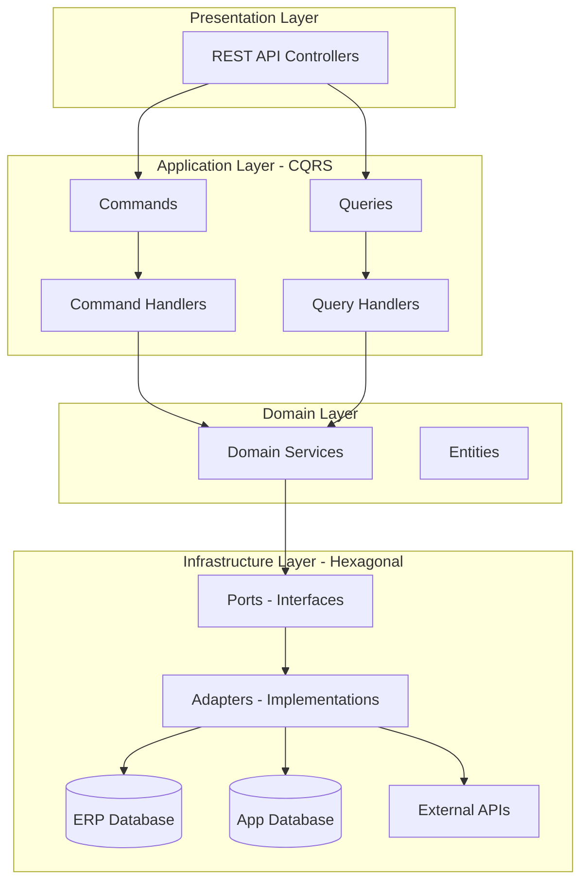
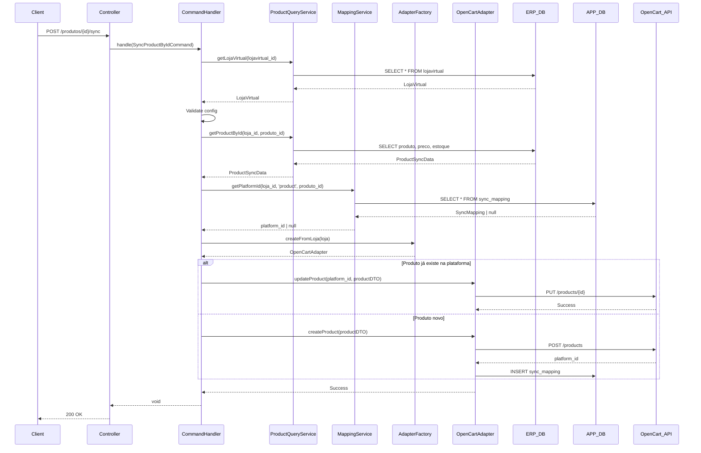

# Arquitetura: CQRS + Hexagonal Architecture

## Visão Geral

Este projeto implementa uma arquitetura híbrida combinando **CQRS (Command Query Responsibility Segregation)** com **Hexagonal Architecture (Ports & Adapters)** para sincronização entre ERP e plataformas de e-commerce.



---

## Camadas da Arquitetura

### 1. Presentation Layer (Controllers)

**Localização:** `apps/api/src/modules/*/`

**Responsabilidade:**
- Receber requisições HTTP
- Validar entrada básica
- Instanciar Commands/Queries
- Invocar Handlers
- Formatar respostas

**Exemplo:**
```typescript
// ProductController.ts
async syncProduct(req: Request, res: Response): Promise<void> {
  const { lojavirtual_id, produto_id } = req.params;
  
  const handler = new SyncProductByIdCommandHandler();
  await handler.handle({ lojavirtual_id, produto_id });
  
  sendSuccess(res, { message: 'Produto sincronizado' });
}
```

**Regras:**
- ❌ Não contém lógica de negócio
- ❌ Não acessa banco de dados diretamente
- ✅ Apenas orquestra Commands/Queries

---

### 2. Application Layer - CQRS

#### Commands (Escrita)

**Localização:** `apps/api/src/modules/sync/commands/`

**Responsabilidade:**
- Representar intenções de mudança de estado
- Transportar dados necessários para a operação

**Estrutura:**
```typescript
// SyncProductByIdCommand.ts
export class SyncProductByIdCommand {
  constructor(
    public readonly lojavirtual_id: string,
    public readonly produto_id: string
  ) {}
}
```

**Características:**
- ✅ Imutável (readonly)
- ✅ Apenas dados, sem lógica
- ✅ Nome no imperativo (Sync, Create, Update, Delete)

---

#### Command Handlers (Executores)

**Localização:** `apps/api/src/modules/sync/commands/handlers/`

**Responsabilidade:**
- Executar a lógica de negócio do comando
- Coordenar serviços de domínio
- Gerenciar transações (quando aplicável)
- Logging e tratamento de erros

**Estrutura:**
```typescript
// SyncProductByIdCommandHandler.ts
export class SyncProductByIdCommandHandler {
  async handle(command: SyncProductByIdCommand): Promise<void> {
    // 1. Validar entrada
    // 2. Buscar dados necessários (via services)
    // 3. Aplicar regras de negócio
    // 4. Chamar adapters para persistência/integração
    // 5. Logging
  }
}
```

**Regras:**
- ✅ Pode usar múltiplos serviços
- ✅ Deve ter logging detalhado
- ✅ Deve tratar erros específicos
- ❌ Não acessa banco diretamente (usa services)

---

#### Queries (Leitura)

**Localização:** `apps/api/src/modules/sync/queries/`

**Responsabilidade:**
- Representar consultas de dados
- Transportar filtros e paginação

**Estrutura:**
```typescript
// ListProductsQuery.ts
export class ListProductsQuery {
  constructor(
    public readonly lojavirtual_id: string,
    public readonly page: number,
    public readonly limit: number,
    public readonly search?: string
  ) {}
}
```

---

#### Query Handlers

**Localização:** `apps/api/src/modules/sync/queries/handlers/`

**Responsabilidade:**
- Executar consultas otimizadas
- Retornar DTOs formatados
- Aplicar filtros e paginação

**Regras:**
- ✅ Pode fazer queries diretas otimizadas
- ✅ Retorna DTOs, não entidades
- ❌ Nunca modifica estado

---

### 3. Domain Layer

#### Domain Services

**Localização:** `apps/api/src/modules/sync/services/`

**Responsabilidade:**
- Encapsular lógica de negócio complexa
- Coordenar acesso a dados
- Aplicar regras de domínio

**Exemplos:**

##### ProductQueryService
```typescript
// Busca produtos elegíveis para sincronização
async getEligibleProducts(lojavirtual_id: string): Promise<ProductSyncData[]>

// Busca um produto específico com preço e estoque
async getProductById(lojavirtual_id: string, produto_id: string): Promise<ProductSyncData | null>

// Busca configuração da loja virtual
async getLojaVirtual(lojavirtual_id: string): Promise<LojaVirtual | null>
```

##### MappingService
```typescript
// Busca mapeamento ERP ↔ Plataforma
async getPlatformId(lojavirtual_id: string, entidade: string, erp_id: string): Promise<string | null>

// Salva mapeamento
async setMapping(lojavirtual_id, entidade, erp_id, platform_id, platform): Promise<SyncMapping>
```

##### SyncLogService
```typescript
// Registra operações de sincronização
async log(data: SyncLogData): Promise<void>
```

**Regras:**
- ✅ Contém lógica de negócio
- ✅ Acessa repositórios/banco de dados
- ✅ Reutilizável entre handlers
- ❌ Não conhece HTTP/Controllers

---

### 4. Infrastructure Layer - Hexagonal

#### Ports (Interfaces)

**Localização:** `apps/api/src/modules/integrations/ports/`

**Responsabilidade:**
- Definir contratos para integrações externas
- Abstrair detalhes de implementação

**Exemplo:**
```typescript
// CommercePlatformAdapter.ts
export interface CommercePlatformAdapter {
  createProduct(data: ProductDTO): Promise<string>;
  updateProduct(id: string, data: ProductDTO, productPlatformId: number): Promise<void>;
  syncStock(id: string, quantity: number): Promise<void>;
  syncPrice(id: string, price: number): Promise<void>;
  getOrders(filters: OrderFilters): Promise<OrderDTO[]>;
  checkHealth(): Promise<HealthCheckResult>;
}
```

**Características:**
- ✅ Define "o que" fazer, não "como"
- ✅ Usa DTOs para transferência de dados
- ✅ Independente de tecnologia

---

#### Adapters (Implementações)

**Localização:** `apps/api/src/modules/integrations/{platform}/`

**Responsabilidade:**
- Implementar as interfaces (ports)
- Lidar com detalhes técnicos da plataforma
- Converter entre DTOs e formatos da plataforma

**Exemplos:**

##### OpenCartAdapter
```typescript
export class OpenCartAdapter implements CommercePlatformAdapter {
  async createProduct(data: ProductDTO): Promise<string> {
    // 1. Autenticar (se necessário)
    // 2. Converter ProductDTO para formato OpenCart
    // 3. Fazer requisição HTTP
    // 4. Salvar mapeamento em SyncMapping
    // 5. Retornar platform_id
  }
}
```

##### VtexAdapter
```typescript
export class VtexAdapter implements CommercePlatformAdapter {
  // Implementação específica para VTEX
}
```

**Regras:**
- ✅ Implementa interface Port
- ✅ Gerencia autenticação
- ✅ Trata erros específicos da plataforma
- ✅ Salva mapeamentos automaticamente
- ❌ Não contém lógica de negócio do domínio

---

#### Adapter Factory

**Localização:** `apps/api/src/modules/integrations/AdapterFactory.ts`

**Responsabilidade:**
- Criar instâncias de adapters baseado em configuração
- Abstrair criação de dependências

**Uso:**
```typescript
const adapter = AdapterFactory.createFromLoja(loja);
// Retorna OpenCartAdapter ou VtexAdapter baseado em loja.plataforma_nome
```

---

## Fluxo de Dados Completo

### Exemplo: Sincronização de Produto Individual



---

## Estrutura de Diretórios

```
apps/api/src/
├── modules/
│   ├── sync/                           # Módulo de sincronização
│   │   ├── commands/                   # CQRS - Commands
│   │   │   ├── SyncProductByIdCommand.ts
│   │   │   ├── SyncCatalogCommand.ts
│   │   │   └── handlers/               # Command Handlers
│   │   │       ├── SyncProductByIdCommandHandler.ts
│   │   │       └── SyncCatalogCommandHandler.ts
│   │   ├── queries/                    # CQRS - Queries
│   │   │   ├── ListProductsQuery.ts
│   │   │   └── handlers/               # Query Handlers
│   │   │       └── ListProductsQueryHandler.ts
│   │   └── services/                   # Domain Services
│   │       ├── ProductQueryService.ts
│   │       ├── MappingService.ts
│   │       └── SyncLogService.ts
│   │
│   ├── integrations/                   # Hexagonal - Ports & Adapters
│   │   ├── ports/                      # Interfaces (Ports)
│   │   │   ├── CommercePlatformAdapter.ts
│   │   │   ├── AuthAdapter.ts
│   │   │   └── PlatformConfig.ts
│   │   ├── opencart/                   # OpenCart Adapter
│   │   │   ├── OpenCartAdapter.ts
│   │   │   └── OpenCartAuthAdapter.ts
│   │   ├── vtex/                       # VTEX Adapter
│   │   │   └── VtexAdapter.ts
│   │   ├── services/                   # Shared services
│   │   │   └── TokenManager.ts
│   │   └── AdapterFactory.ts           # Factory Pattern
│   │
│   └── products/                       # Presentation Layer
│       └── ProductController.ts
│
├── entities/                           # TypeORM Entities
│   ├── erp/                            # ERP Database
│   │   ├── LojaVirtual.ts
│   │   ├── Produtos.ts
│   │   └── ...
│   └── app/                            # Application Database
│       ├── SyncMapping.ts
│       └── SyncLog.ts
│
└── config/
    ├── database.ts                     # Database connections
    └── logger.ts                       # Winston logger
```

---

## Padrões e Convenções

### Naming Conventions

| Tipo | Padrão | Exemplo |
|------|--------|---------|
| Command | `{Verb}{Entity}Command` | `SyncProductByIdCommand` |
| Command Handler | `{Command}Handler` | `SyncProductByIdCommandHandler` |
| Query | `{Verb}{Entity}Query` | `ListProductsQuery` |
| Query Handler | `{Query}Handler` | `ListProductsQueryHandler` |
| Service | `{Entity}{Purpose}Service` | `ProductQueryService` |
| Adapter | `{Platform}Adapter` | `OpenCartAdapter` |
| Port | `{Purpose}Adapter` (interface) | `CommercePlatformAdapter` |
| DTO | `{Entity}DTO` | `ProductDTO` |

### Logging Conventions

```typescript
// Início de operação
logger.info('Starting product sync', { lojavirtual_id, produto_id });

// Debug detalhado
logger.debug('Step 1: Loading loja virtual', { lojavirtual_id });

// Sucesso
logger.info('Product synced successfully', { produto_id, platform_id });

// Erro
logger.error('Error syncing product', { 
  produto_id, 
  error: error.message,
  stack: error.stack 
});
```

### Error Handling

```typescript
try {
  // Operação
} catch (error: any) {
  logger.error('Operation failed', {
    context: 'relevant data',
    error: error.message,
    stack: error.stack,
  });
  throw error; // Re-throw para controller tratar
}
```

---

## Guia de Implementação: Novo Command

### 1. Criar Command

```typescript
// apps/api/src/modules/sync/commands/MyNewCommand.ts
export class MyNewCommand {
  constructor(
    public readonly param1: string,
    public readonly param2: number
  ) {}
}
```

### 2. Criar Command Handler

```typescript
// apps/api/src/modules/sync/commands/handlers/MyNewCommandHandler.ts
import { MyNewCommand } from '../MyNewCommand';
import { logger } from '../../../../config/logger';
import { ProductQueryService } from '../../services/ProductQueryService';
import { AdapterFactory } from '../../../integrations/AdapterFactory';

export class MyNewCommandHandler {
  async handle(command: MyNewCommand): Promise<void> {
    logger.info('Starting operation', { param1: command.param1 });

    try {
      // 1. Buscar dados necessários
      const service = new ProductQueryService();
      const data = await service.getData(command.param1);

      // 2. Validar
      if (!data) {
        throw new Error('Data not found');
      }

      // 3. Criar adapter
      const adapter = AdapterFactory.createFromLoja(data.loja);

      // 4. Executar operação
      await adapter.doSomething(data);

      logger.info('Operation completed successfully');
    } catch (error: any) {
      logger.error('Operation failed', {
        param1: command.param1,
        error: error.message,
        stack: error.stack,
      });
      throw error;
    }
  }
}
```

### 3. Adicionar ao Controller

```typescript
// apps/api/src/modules/products/ProductController.ts
async myNewOperation(req: Request, res: Response): Promise<void> {
  try {
    const { param1 } = req.params;
    const param2 = parseInt(req.body.param2);

    const handler = new MyNewCommandHandler();
    await handler.handle(new MyNewCommand(param1, param2));

    sendSuccess(res, { message: 'Operation completed' });
  } catch (error: any) {
    logger.error('Controller error', error);
    sendError(res, 'Operation failed', 500);
  }
}
```

### 4. Adicionar Rota

```typescript
// apps/api/src/routes/productRoutes.ts
router.post(
  '/lojavirtual/:lojavirtual_id/my-operation',
  authenticate,
  productController.myNewOperation.bind(productController)
);
```

---

## Princípios SOLID Aplicados

### Single Responsibility Principle (SRP)
- ✅ Cada handler tem uma única responsabilidade
- ✅ Services encapsulam lógica específica
- ✅ Adapters lidam apenas com integração de uma plataforma

### Open/Closed Principle (OCP)
- ✅ Novos adapters podem ser adicionados sem modificar código existente
- ✅ Factory abstrai criação de adapters

### Liskov Substitution Principle (LSP)
- ✅ Qualquer implementação de `CommercePlatformAdapter` pode ser usada intercambiavelmente

### Interface Segregation Principle (ISP)
- ✅ Interfaces específicas (AuthAdapter, CommercePlatformAdapter)
- ✅ Clients não dependem de métodos que não usam

### Dependency Inversion Principle (DIP)
- ✅ Handlers dependem de abstrações (interfaces), não de implementações concretas
- ✅ AdapterFactory injeta dependências

---

## Benefícios da Arquitetura

### Testabilidade
- ✅ Handlers podem ser testados com mocks de services
- ✅ Adapters podem ser testados isoladamente
- ✅ Services podem ser testados com banco em memória

### Manutenibilidade
- ✅ Mudanças em uma plataforma não afetam outras
- ✅ Lógica de negócio centralizada em handlers
- ✅ Fácil adicionar novas plataformas

### Escalabilidade
- ✅ Commands podem ser processados assincronamente (futuro)
- ✅ Queries otimizadas separadamente
- ✅ Adapters podem ter cache independente

### Clareza
- ✅ Fluxo de dados explícito
- ✅ Responsabilidades bem definidas
- ✅ Fácil onboarding de novos desenvolvedores

---

## Referências

- [CQRS Pattern - Martin Fowler](https://martinfowler.com/bliki/CQRS.html)
- [Hexagonal Architecture - Alistair Cockburn](https://alistair.cockburn.us/hexagonal-architecture/)
- [Clean Architecture - Robert C. Martin](https://blog.cleancoder.com/uncle-bob/2012/08/13/the-clean-architecture.html)
