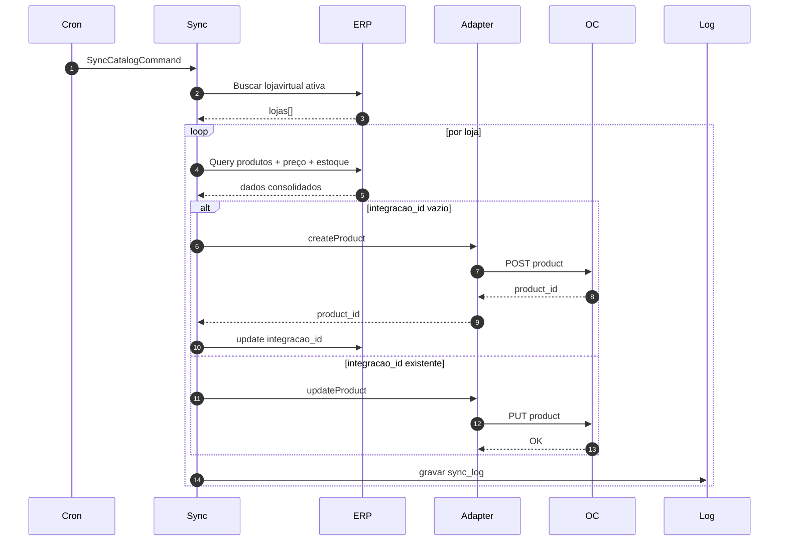
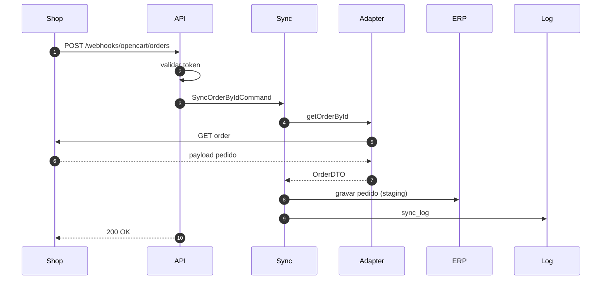
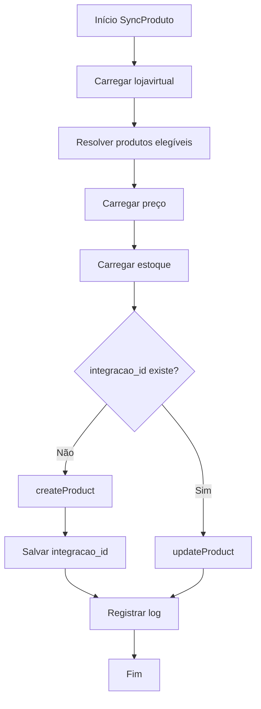
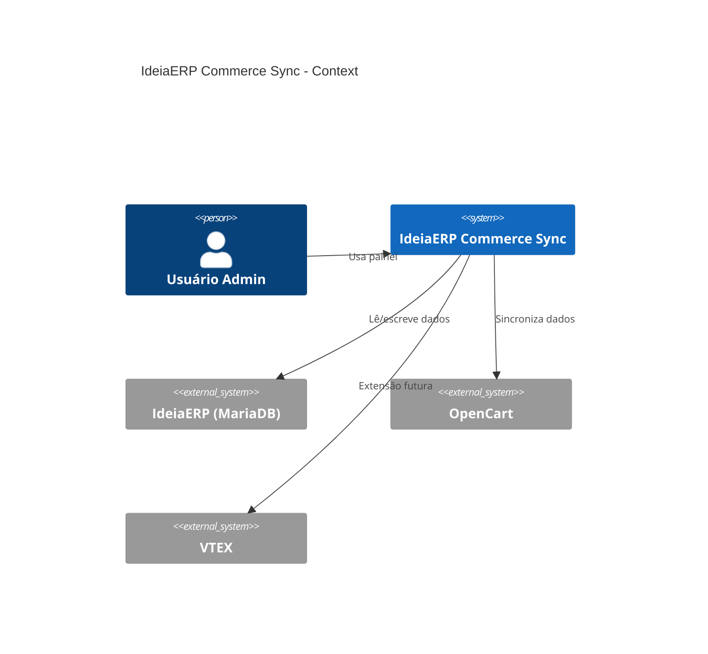
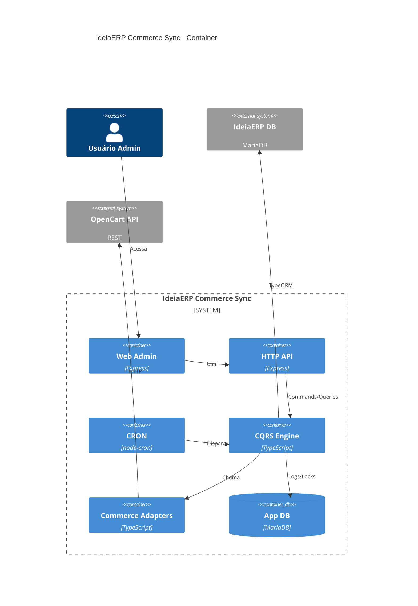
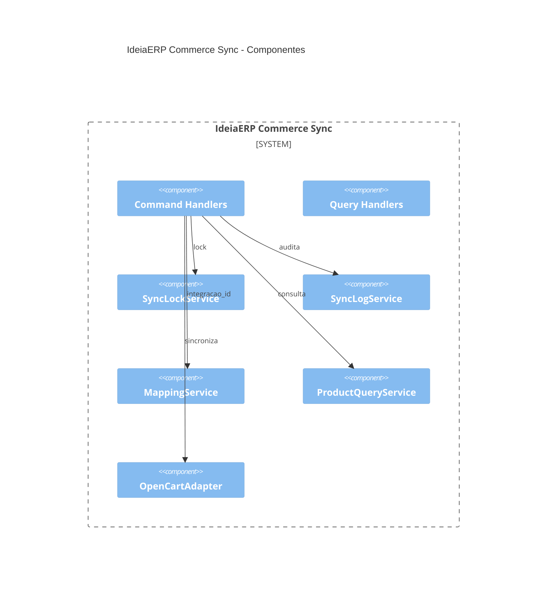

# Diagramas – IdeiaERP Commerce Sync
Este documento contém **todos os diagramas Mermaid e C4** do projeto **IdeiaERP Commerce Sync**.
Pode ser usado diretamente no GitHub, Cursor, Obsidian ou qualquer viewer compatível com Mermaid.

---

## 1. Visão Geral – Arquitetura de Alto Nível

```mermaid
flowchart LR
  subgraph ERP[IdeiaERP (MariaDB)]
    LV[lojavirtual]
    P[Produtos]
    C[Categoria]
    M[Marca]
    TP[TabelaPreco]
    PTP[ProdutoTabelaPreco]
    E[Estoque]
    PE[produtoestoque]
    CP[caracteristicaproduto]
    PCP[produtocaracteristicaproduto]
    U[Usuario]
    LVE[LojaVirtualExportacao]
  end

  subgraph APP[IdeiaERP Commerce Sync (Node.js/Express)]
    API[HTTP API / Admin]
    CRON[CRON Scheduler]
    SYNC[Sync Engine (CQRS)]
    LOGS[(app_db)]
    ADP[Adapters]
  end

  subgraph ECOM[Plataforma E-commerce]
    OC[OpenCart API]
    VT[VTEX API]
    WH[Webhook Orders]
  end

  LV --> SYNC
  P --> SYNC
  C --> SYNC
  M --> SYNC
  TP --> SYNC
  PTP --> SYNC
  E --> SYNC
  PE --> SYNC
  CP --> SYNC
  PCP --> SYNC

  CRON --> SYNC
  API --> SYNC
  SYNC --> LOGS

  SYNC --> ADP
  ADP --> OC
  ADP --> VT

  WH --> API
  U --> API
```

---

## 2. Sequência – Sincronização de Produtos (ERP → Loja)



---

## 3. Sequência – Webhook de Pedido (Loja → ERP)



---

## 4. Fluxo de Decisão – Produto



---

## 5. C4 – Context (Nível 1)



---

## 6. C4 – Container (Nível 2)



---

## 7. C4 – Component (Nível 3)



---

**Fim dos diagramas.**
